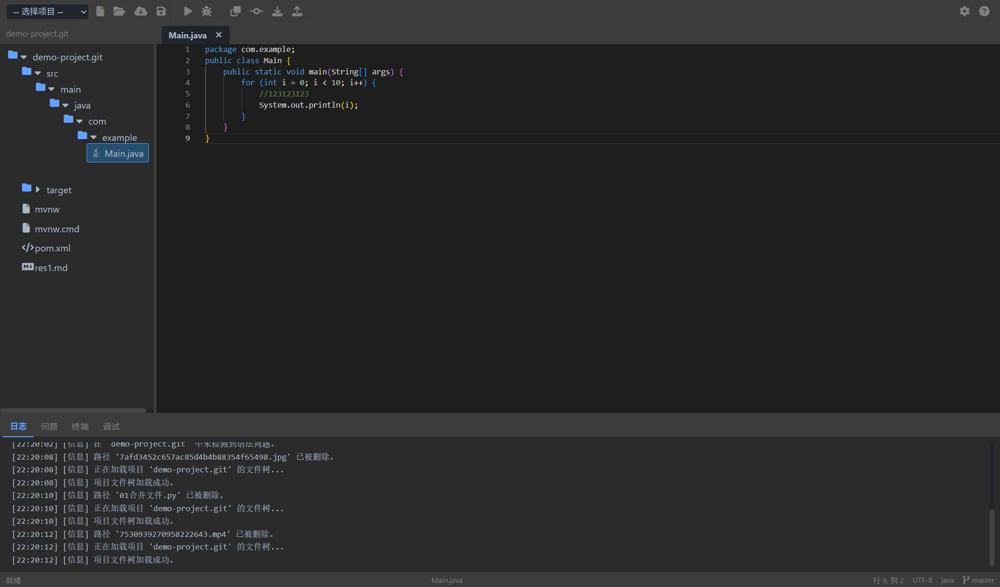
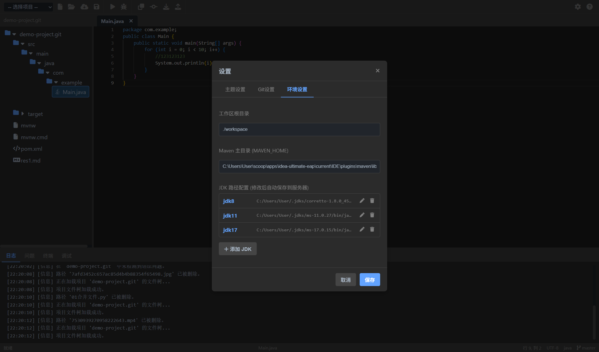

# 🚀 Web IDE - 您的浏览器集成开发环境

[](https://github.com/git-hub-cc/IDEA)
[](https://github.com/git-hub-cc/IDEA/blob/main/LICENSE)
[](https://www.java.com)
[](https://spring.io/projects/spring-boot)
[](https://microsoft.github.io/monaco-editor/)

**Web IDE** 是一个基于浏览器的集成开发环境，专为 Java (Maven) 项目设计，其外观和用户体验**深度借鉴了 JetBrains IntelliJ IDEA**。它旨在提供一个轻量级、跨平台且功能丰富的远程开发解决方案，让开发者在任何设备上都能获得熟悉而高效的编码体验。

### ✨ 项目亮点

-   **零客户端配置**：所有开发环境（JDK, Maven）均在服务端配置，用户只需一个现代浏览器即可开始编码。
-   **熟悉的 IDEA 风格界面**：精心设计的 UI，模仿了 IntelliJ IDEA 的经典布局、图标和交互逻辑。
-   **完整的开发生命周期**：支持从代码编写、编译、运行到调试和版本控制的全过程。
-   **实时交互体验**：通过 WebSocket 实现实时日志、终端交互和调试事件，提供桌面级应用的体验。
-   **高度可扩展**：模块化的前后端设计，便于未来扩展对更多语言和功能的支持。

---

## 📸 应用截图

| 主界面布局 (深色主题)                           | 强大的设置面板 (可配置环境)                     |      
| ----------------------------------------------- | ----------------------------------------------- | 
|  |  | 

---

## 🌟 核心功能

-   **📁 项目与文件管理**: 支持Git克隆、本地文件夹上传、文件树操作（增删改查、拖拽上传）。
-   **💻 智能代码编辑器**: 基于 **Monaco Editor**，提供语法高亮、代码补全（Java类名、代码片段）、实时错误检测。
-   **☕ Java 开发工作流**: 深度集成 **Maven**，支持一键构建、运行，并通过 WebSocket 实时反馈日志。
-   **🐞 集成调试器 (JDI)**: 支持图形化断点、步进调试（步过/步入/步出）、变量检查和调用栈视图。
-   **🌿 版本控制 (Git)**: 集成 **JGit**，提供`commit`, `push`, `pull` 等核心操作，并在状态栏实时显示分支与文件状态。
-   **🔌 集成终端**: 提供一个真实的后端 Shell (Bash/CMD)，通过 WebSocket 实现全功能交互式终端。
-   **⚙️ 高度可定制化**:
    - **环境配置**: 灵活配置工作区、Maven Home 及多版本 JDK 路径。
    - **外观**: 支持 IntelliJ Darcula (深色) 和 Light (浅色) 主题，可自定义编辑器字体。
    - **会话管理**: 采用单用户锁定机制，确保操作环境的纯净与安全。

---

## 🛠️ 技术栈与第三方库

本项目采用了前后端分离的现代化技术架构。

### **后端 (Backend)**

-   **核心框架**:
    - **Spring Boot 3.2.5**: 提供快速、稳健的后端应用基础。
        - `spring-boot-starter-web`: 用于构建 RESTful API。
        - `spring-boot-starter-websocket`: 实现 WebSocket 和 STOMP 协议，用于实时通信。
        - `spring-boot-starter-validation`: 提供数据校验支持。
-   **语言与构建**:
    - **Java 17**: 充分利用现代 Java 的特性。
    - **Apache Maven**: 作为项目构建和依赖管理工具。
-   **核心功能库**:
    - **Eclipse JGit**: Java 实现的 Git 库，用于处理版本控制操作。
    - **JavaParser**: 用于静态解析 Java 源代码，提取类名、发现语法错误。
    - **Java Debug Interface (JDI)**: 通过 `com.sun.jdi` 实现与 JVM 调试器的交互。
-   **工具库**:
    - **Google Gson**: 用于高效的 JSON 序列化与反序列化。
    - **Project Lombok**: 减少样板代码，使实体类更简洁。
    - **Apache Commons IO**: 提供强大的 I/O 操作工具。

### **前端 (Frontend)**

-   **核心技术**:
    - **HTML5 / CSS3 / JavaScript (ES6 Modules)**: 无前端框架，采用原生技术构建，以实现最大化的控制和性能。
-   **核心功能库**:
    - **Monaco Editor**: Visual Studio Code 的核心编辑器组件，提供强大的代码编辑功能。
    - **SockJS & Stomp.js**: 提供稳定、兼容性好的 WebSocket 客户端，用于与后端实时通信。
    - **AnsiUp.js**: 将后端终端返回的 ANSI 转义码转换为带样式的 HTML，实现彩色终端输出。
    - **Font Awesome**: 提供丰富的图标集，增强 UI 表现力。

### **开发与部署**

-   **容器化**: **Docker** & **Docker Compose**，用于实现一键式、可移植的部署方案。

---

## 🚀 快速开始

### 1. 本地环境部署

#### **环境要求**
-   JDK 17 或更高版本
-   Apache Maven 3.6+
-   Git

#### **步骤**

1.  **克隆项目**:
    ```bash
    git clone https://github.com/git-hub-cc/IDEA.git
    cd IDEA
    ```

2.  **配置后端** (`src/main/resources/application.properties`):
    - **（关键）** 配置 `app.maven.home` 为您本地 Maven 的安装目录。
    - **（关键）** 在 `app.jdk.paths` 中至少配置一个 JDK 的 `java` 可执行文件绝对路径。
    - **（可选）** 配置 `gitee.api.access-token` 以启用 Gitee 仓库克隆功能。

3.  **运行后端**:
    ```bash
    mvn spring-boot:run
    ```

4.  **访问应用**: 打开浏览器访问 [http://localhost:8080](http://localhost:8080)。

### 2. Docker 部署

#### **环境要求**
-   Docker
-   Docker Compose

#### **步骤**

1.  **构建并启动容器**:
    ```bash
    docker-compose up --build
    ```

2.  **访问应用**: 打开浏览器访问 [http://localhost:8082](http://localhost:8082)。

---

## ⚙️ 配置说明

应用启动后，所有配置将从 `.ide/settings.json` 文件加载。您可以通过点击界面右上角的 **设置 (⚙️)** 图标来修改配置，所有更改将实时保存到服务器。

-   **环境设置**: 配置工作区、Maven Home 和多版本 JDK 路径。
-   **Git 设置**: 配置代码托管平台（Gitee/GitHub）及其访问令牌。
-   **主题设置**: 切换深/浅色主题，自定义编辑器外观。

---

## 🤝 贡献

欢迎对本项目做出贡献！如果您有任何想法、建议或发现 Bug，请随时提交 Issue 或 Pull Request。

1.  Fork 本仓库 (`https://github.com/git-hub-cc/IDEA`)
2.  创建您的功能分支 (`git checkout -b feature/AmazingFeature`)
3.  提交您的更改 (`git commit -m 'feat: Add some AmazingFeature'`)
4.  推送到分支 (`git push origin feature/AmazingFeature`)
5.  打开一个 Pull Request

---

## 📄 许可证

本项目采用 [MIT 许可证](https://github.com/git-hub-cc/IDEA/blob/main/LICENSE)。